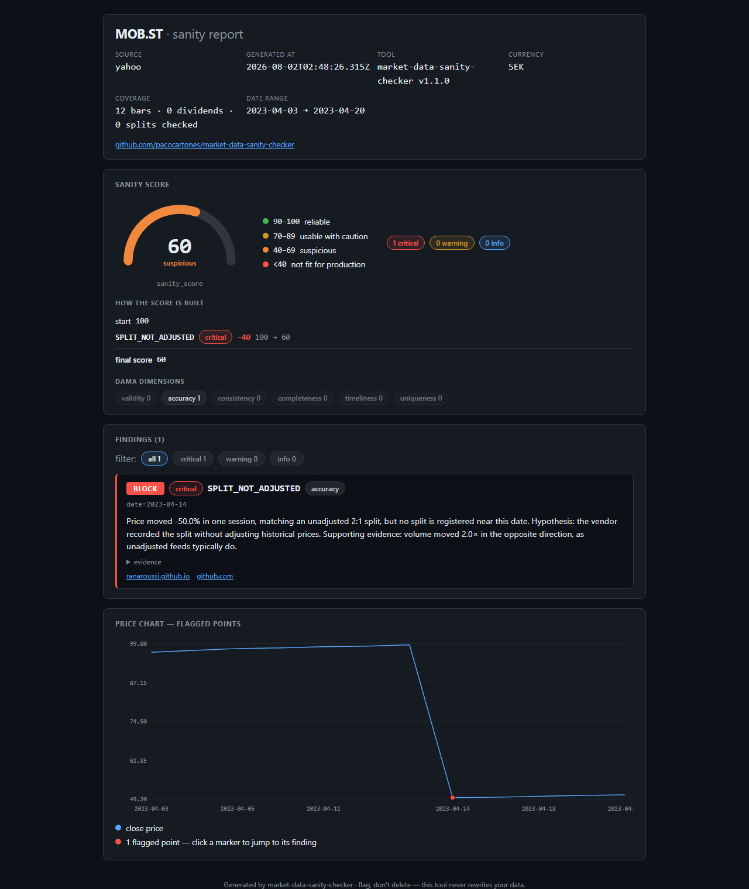

# market-data-sanity-checker

[](https://github.com/pacocartones/market-data-sanity-checker/actions/workflows/ci.yml)
[](https://www.npmjs.com/package/market-data-sanity-checker)
[](https://www.npmjs.com/package/market-data-sanity-checker)
[](https://nodejs.org)
[](https://github.com/pacocartones/market-data-sanity-checker/actions/workflows/ci.yml)
[](https://pacocartones.github.io/market-data-sanity-checker/)
[](LICENSE)

> **Trust layer for market data.** Validate, score and explain anomalies in OHLCV, dividends,
> splits and fundamentals — before they break your screener, dashboard or tracker.



- [Quickstart](#quickstart-30-seconds)
- [Why this exists](#why-this-exists)
- [Install](#install)
- [Usage](#usage)
- [The sanity score](#the-sanity-score)
- [Rule catalog](#rule-catalog)
- [When NOT to use it](#when-not-to-use-it)
- [FAQ](#faq)
- [Development & contributing](#development)

Data quality / validation for market data, as a library and CLI. Not another generic data
validator: this tool understands the semantics of financial data — corporate actions,
adjustments, currencies, exchanges — and tells you **what** is suspicious, **why**, **what
impact** it has, and whether to **block**, **flag** or **review** the datum.



*A real `mdsc check` on MOB.ST: the phantom −50% "crash" is an unadjusted 2:1 split —
detected, scored, and explained with the volume evidence. One self-contained `.html` file —
works offline, interactive chart, no server.*

## Quickstart (30 seconds)

No install, no API key — audit a live symbol straight from Yahoo Finance:

```bash
npx market-data-sanity-checker check --provider yahoo --symbol AAPL
```

```
AAPL (yahoo) — sanity_score: 95/100
findings: 0 critical · 0 warning · 1 info
```

Or point it at your own data (CSV/JSON — headers are auto-mapped) and get the interactive
HTML dashboard:

```bash
npx market-data-sanity-checker check --file your-data.csv --html report.html
```

That's the whole loop: **score** (0–100), **findings** (what's suspicious, why, with
evidence), **action** (`block` / `flag` / `review`). See [docs/examples.md](docs/examples.md)
for real caught-in-the-wild cases — the phantom −50% split crash, the $185 Berkshire tick,
pence/pounds ×100 — each reproducible from the shipped fixtures.

## Why this exists

Market data is wrong more often than you think:

- **June 3, 2024** — a SIP software bug showed Berkshire Hathaway (BRK.A) at **$185** instead
  of ~$621,000 (−99.9%). Trades executed on the bad price cost Interactive Brokers **$48M**.
- **July 3, 2017** — Nasdaq test data propagated to Google Finance, Bloomberg and Yahoo,
  showing AAPL, GOOG and MSFT all at **$123.47**.
- Yahoo Finance regularly ships **unadjusted splits** that look like −50% crashes, dividends
  scaled **100×** (the classic LSE pence/pounds confusion), and duplicated dividends.
- Tickers get **reused** (`AB` has named 6 different companies), silently splicing two firms
  into one price series.

Generic data quality tools (Great Expectations, Soda, Pandera) check structure — nulls,
ranges, schemas. Data vendors (yfinance, ccxt) fetch data but don't audit it. Nothing open
source sits in between. `mdsc` is that missing layer.

## Principles

1. **Causal explanation, not binary checks.** Every finding carries a hypothesis
   ("possible unadjusted 2:1 split"), the evidence behind it, and a recommended action.
2. **Flag, don't delete.** This tool never rewrites your data. It detects, explains and
   scores — the decision stays with you.
3. **Conservative thresholds.** Every threshold comes with a citation (academic literature or
   a documented real-world incident) and is configurable. False negatives are acceptable;
   false positives destroy trust.
4. **Provider-agnostic.** The core works on CSV/JSON with a canonical internal schema.
   Provider connectors are plugins, never core.

## Install

```bash
npm install market-data-sanity-checker   # or: pnpm add market-data-sanity-checker
```

## Usage

### CLI

```bash
# check a CSV of OHLCV bars (date,open,high,low,close,volume — headers are auto-mapped)
mdsc check --file aapl.csv --symbol AAPL --source yahoo

# fetch and check straight from a provider (no API key needed for Yahoo)
mdsc check --provider yahoo --symbol AAPL --range 1y

# compare two sources for the same symbol
mdsc compare --symbol AAPL --providers yahoo,alpha-vantage
mdsc compare --files yahoo-aapl.json,stooq-aapl.csv
# (PowerShell: quote values with commas — "yahoo,alpha-vantage" — or the shell swallows the comma)

# machine-readable report
mdsc check --file aapl.json --format json > report.json

# provider status and rule catalog
mdsc providers
mdsc rules
```

Exit codes: `0` gate passed · `1` gate failed (critical findings, or `--fail-on`/`--min-score`)
· `2` operational error (file unreadable, invalid flags, provider unavailable, invalid config).

Providers are plugins: `yahoo` works keyless; `alpha-vantage` needs the
`ALPHA_VANTAGE_API_KEY` env var (free key at alphavantage.co). New providers plug in via
the `Connector` contract (`src/connectors/types.ts`).

### Configuration (`mdsc.config.json`)

Every threshold is project-tunable without touching code — drop a `mdsc.config.json` in
your working directory (or pass `--config <path>`). Unknown rule ids are a hard error
with the valid catalog:

```json
{
  "rules": {
    "RETURN_SPIKE": { "params": { "zscoreThreshold": 5 } },
    "STALE_PRICE": { "enabled": false },
    "SPLIT_NOT_ADJUSTED": { "severity": "warning" }
  },
  "compareRules": {
    "VOLUME_DIVERGENCE": { "enabled": false }
  }
}
```

### CI gating, history and dashboards

```bash
# gate your pipeline: exit 1 on warnings too, or when the score drops
mdsc check --provider yahoo --symbol AAPL --fail-on warning --min-score 80

# keep an audit trail and see the trend
mdsc check --provider yahoo --symbol AAPL --save
mdsc history --symbol AAPL

# self-contained HTML dashboard (offline, interactive — great CI artifact)
mdsc check --file aapl.csv --html report.html
```

### SDK

```ts
import { ingestFile, marketDataSetSchema, checkMarketData } from 'market-data-sanity-checker'

const raw = await ingestFile('aapl.csv', { symbol: 'AAPL', source: 'yahoo' })
const dataset = marketDataSetSchema.parse(raw)
const report = checkMarketData(dataset)

console.log(report.sanity_score) // 0–100
for (const finding of report.findings) {
  console.log(finding.severity, finding.rule, finding.explanation)
}
```

Fetch and compare sources with the connector plugins:

```ts
import { yahoo, alphaVantage, compareDatasets } from 'market-data-sanity-checker'

const a = await yahoo.fetchDaily('AAPL', { range: '1y' })
const b = await alphaVantage.fetchDaily('AAPL') // needs ALPHA_VANTAGE_API_KEY
const comparison = compareDatasets(a, b)

console.log(comparison.consistency_score, comparison.compared_dates)
```

Every threshold is a parameter — rules can be tuned, re-severitized or disabled:

```ts
const report = checkMarketData(dataset, {
  rules: {
    RETURN_SPIKE: { params: { zscoreThreshold: 5 } },
    STALE_PRICE: { enabled: false },
    SPLIT_NOT_ADJUSTED: { severity: 'warning' },
  },
})
```

### Report shape

```json
{
  "symbol": "MOB.ST",
  "source": "yahoo",
  "sanity_score": 60,
  "findings": [
    {
      "rule": "SPLIT_NOT_ADJUSTED",
      "severity": "critical",
      "action": "block",
      "dimension": "accuracy",
      "where": { "date": "2023-04-14" },
      "explanation": "Price moved -50.0% in one session, matching an unadjusted 2:1 split, but no split is registered near this date. Hypothesis: the vendor recorded the split without adjusting historical prices. Supporting evidence: volume moved 2.0× in the opposite direction, as unadjusted feeds typically do.",
      "evidence": { "return": -0.5, "hypothesized_ratio": "2:1", "previous_close": 99.4, "close": 49.7, "volume_ratio": 2 },
      "references": ["https://ranaroussi.github.io/yfinance/advanced/price_repair.html"],
      "occurrences": 1
    }
  ],
  "summary": { "critical": 1, "warning": 0, "info": 0 },
  "generated_at": "2026-07-31T17:00:00.000Z"
}
```

### The sanity score

`sanity_score = max(0, 100 − Σ penalties)`. Each finding penalizes by severity:
critical **−40**, warning **−15**, info **−5**. A rule penalizes **once per dataset**,
at its highest severity — 847 bars with the same defect must not drive the score below
zero; the finding carries `occurrences` instead.

| Score | Band |
|---|---|
| 90–100 | reliable |
| 70–89 | usable with caution |
| 40–69 | suspicious |
| <40 | not fit for production |

## Rule catalog

The corpus ships **36 rules**: 29 single-source across four blocks, plus 7 multi-source
compare rules. Full details with defaults and references: `mdsc rules` (or
`--format json`). Real-case fixtures anchor the headline rules:
[`tests/fixtures/`](tests/fixtures/), documented in [`docs/fixtures.md`](docs/fixtures.md).

### Price / OHLCV (13)

| Rule | Severity | What it catches |
|---|---|---|
| `SPLIT_NOT_ADJUSTED` ⭐ | critical | Price jump matching a split ratio with no split registered (phantom −50% "crashes") |
| `PRICE_SPIKE_INTRADAY` | critical | Isolated bad ticks: far outside the neighbourhood AND reverted next session (Berkshire 2024) |
| `PRICE_NONPOSITIVE` | critical | Zero/negative/NaN prices |
| `OHLC_INCONSISTENT` | critical | `high < low`, open/close outside [low, high] |
| `VOLUME_NEGATIVE` | critical | Negative or non-finite volume |
| `TS_DUPLICATED` | critical | Two bars for the same timestamp |
| `RETURN_SPIKE` | warning | Robust statistical outlier returns (modified z-score), deduplicated against splits |
| `CURRENCY_SCALE_SUSPECT` | warning | Persistent ~100× level shifts — pence/pounds (GBX/GBP) block confusion |
| `STALE_PRICE` | warning | Identical close for 3+ sessions with volume — frozen feed |
| `BAR_MISSING` | warning | Gaps of a full trading week or more |
| `TS_UNORDERED` | warning | Bars out of chronological order |
| `ZERO_VOLUME_MOVED` | warning | Zero volume but price moved intraday |
| `INSUFFICIENT_DATA` | warning | Too few bars to evaluate plausibility — the score reflects absence of evidence |

### Corporate actions (9)

| Rule | Severity | What it catches |
|---|---|---|
| `EXDATE_AFTER_PAYDATE` | warning | Payment date preceding ex-date (field swap, unless a large special dividend mandates it) |
| `DIV_DUPLICATED` | warning | Same dividend recorded twice within days (ALC.SW 2023) |
| `EXDATE_MISPLACED` | warning | No price drop on the registered ex-date, matching drop days later (TETY.ST) |
| `DIV_NOT_ADJUSTED` | warning | Dividend registered but pre-ex-date prices unadjusted (8TRA.DE, 1398.HK) |
| `DIV_SCALE_100X` | warning | Single dividend implausibly large — ×100 pence/pounds error (HLCL.L, LTI.L) |
| `DIV_YIELD_IMPOSSIBLE` | warning | TTM dividend yield above the 20% plausibility bound |
| `DIV_SPECIAL_MISCLASSIFIED` | info | "Regular" dividend that is an extreme outlier vs the issuer's own history |
| `SPLIT_RATIO_IMPROBABLE` | warning / info | Split ratio extreme or 1:1; near-1 ratios flagged as probable spin-offs (info) |
| `CORPORATE_ACTION_MISSING_FROM_FACTOR` | warning | Prices adjusted (factor < 1) with no dividend/split registered to explain it |

### Fundamentals (4)

| Rule | Severity | What it catches |
|---|---|---|
| `FUNDAMENTALS_SIGN_VALIDITY` | critical | marketCap or sharesOutstanding non-positive or non-finite |
| `MARKETCAP_MISMATCH` | warning | marketCap ≠ sharesOutstanding × price (Alphabet case) |
| `PE_EPS_INCOMPATIBLE` | warning | P/E incompatible with EPS and price |
| `PAYOUT_IMPOSSIBLE` | warning | Payout ratio negative or far above 300% of EPS (REIT-aware) |

### Metadata (3)

| Rule | Severity | What it catches |
|---|---|---|
| `CURRENCY_SUSPECT` | warning / info | GBP label on pence-looking prices; currency absent (info) |
| `SYMBOL_MAPPING_SUSPECT` | warning | ISIN checksum invalid; ISIN country inconsistent with exchange (ticker reuse) |
| `DIVIDEND_FX_MISMATCH` | warning | Dividend currency differs from the series currency (Shell pays USD, trades GBX) |

### Compare (multi-source, 7)

| Rule | Severity | What it catches |
|---|---|---|
| `SYMBOL_MISMATCH` | critical | The two datasets are for different symbols — comparison is meaningless |
| `INSUFFICIENT_OVERLAP` | warning | Too few shared dates between sources — agreement cannot be evaluated |
| `CLOSE_DIVERGENCE` | warning | Systematic close disagreement between two sources |
| `DIVIDEND_MISMATCH` | warning | Dividend missing or different in the other source |
| `SPLIT_MISMATCH` | warning | Split missing or with a different ratio in the other source (phantom-crash factory) |
| `PRICE_DATE_MISMATCH` | info | Specific dates where the sources disagree beyond tolerance |
| `VOLUME_DIVERGENCE` | info | Systematic volume disagreement (volumes are not cross-comparable) |

Findings carry `rule`, `severity` (critical/warning/info), `action` (block/flag/review),
`dimension` (DAMA data quality dimension), a human-readable `explanation`, `evidence`, and
`references` to the incident or literature justifying the rule.

## When NOT to use it

- **It does not repair data.** `mdsc` flags, never rewrites — *flag, don't delete*. If you
  need automatic price repair (yfinance-style), do it downstream, on your own call.
- **It is not for realtime or tick data.** The unit of analysis is the daily bar plus
  corporate actions; intraday streams and tick-level feeds are out of scope.
- **It does not cover options or futures corporate actions.** The semantics are modeled
  for equities/ETFs; derivative chains, rolls and expiries are not checked.
- **It is not a substitute for paid point-in-time data.** It catches vendor defects, but
  survivorship-bias-free, restatement-aware datasets remain a paid-vendor feature.

## FAQ

**Why does Yahoo Finance show −50% crashes that never happened — and does `mdsc` catch them?**
Those are unadjusted splits: the vendor records the split but doesn't adjust historical
prices, so a 2:1 split looks like a −50% crash. `SPLIT_NOT_ADJUSTED` (critical) matches the
jump against plausible split ratios and cross-checks the volume signature; the compare rule
`SPLIT_MISMATCH` catches sources that disagree on the split itself.

**What is the `sanity_score`?**
A 0–100 quality score per dataset: `max(0, 100 − Σ penalties)` with −40/−15/−5 per
critical/warning/info finding, each rule penalizing once per dataset. 90+ reliable,
70–89 usable with caution, 40–69 suspicious, below 40 not fit for production. See
[The sanity score](#the-sanity-score).

**Does `mdsc` fix my data?**
No — *flag, don't delete*. It detects, explains and scores anomalies, and recommends an
action (`block`/`flag`/`review`); the decision and any repair stay with you.

**Which data sources are supported?**
Any CSV/JSON you can map to the canonical schema (`mdsc check --file`), Yahoo Finance
keyless (`--provider yahoo`), and Alpha Vantage with a free API key. New providers plug in
via the `Connector` contract.

**Can I gate CI on data quality?**
Yes: `mdsc check --provider yahoo --symbol AAPL --fail-on warning --min-score 80` exits 1
when the gate fails (0 pass, 2 operational error) — drop it into any pipeline.

**How is this different from Great Expectations or Pandera?**
Those are generic, structure-first validators (nulls, ranges, schemas) you configure
yourself. `mdsc` is domain-first: it ships 36 rules that understand market-data semantics —
splits, dividends, pence/pounds, ticker reuse — each with a causal explanation, evidence,
a literature or incident reference, and a tunable severity, plus multi-source comparison.

## Roadmap

- [x] **Phase 0** — canonical schema, CSV/JSON ingestion, scoring model, CLI, CI
- [x] **Phase 1** — OHLCV rules engine (12 rules: unadjusted splits, bad ticks, stale
      prices, currency scale suspects…), per-rule config, `mdsc rules` → **v0.1.0**
- [x] **Phase 2** — corporate actions, fundamentals and metadata (13 rules), `identifiers`
      schema (ISIN/CUSIP/FIGI), golden report-contract tests → **v0.2.0**
- [x] **Phase 3** — provider connectors (Yahoo keyless, Alpha Vantage), comparison engine
      (`mdsc compare`, 5 compare rules), provider scoreboard, real-data calibration →
      **v0.3.0**
- [x] **Phase 4** — `mdsc.config.json` custom rules, CI gating (`--fail-on`/`--min-score`),
      audit history (`mdsc history`), self-contained HTML dashboards, OKF datapackage →
      **v1.0.0**
- [ ] **Phase 5+** (if traction) — user rule plugins, hosted API, more connectors, web app

## Provider scoreboard

The project audits itself against reality, publicly: [`scoreboard/`](scoreboard/) holds
the latest weekly audit of ~30 liquid symbols per provider (mean sanity score, worst
symbols, findings), regenerated every Monday by a GitHub Action and reproducible by
anyone with `pnpm scoreboard`. [`calibration/`](calibration/) holds the latest 50-symbol
calibration run — the corpus's honesty loop against real Yahoo data.

## Development

```bash
pnpm install
pnpm test         # vitest
pnpm typecheck    # tsc --noEmit
pnpm lint         # eslint
pnpm build        # tsup → dist/
pnpm dev check --file tests/fixtures/ohlcv-valid.csv
```

Maintainer log and OKRs: [docs/maintainer/](docs/maintainer/)

## Contributing

See [CONTRIBUTING.md](CONTRIBUTING.md). The short version: every rule needs a stable ID, a
severity, a documented real-world case or literature reference, and a fixture.

## License

[MIT](LICENSE)

